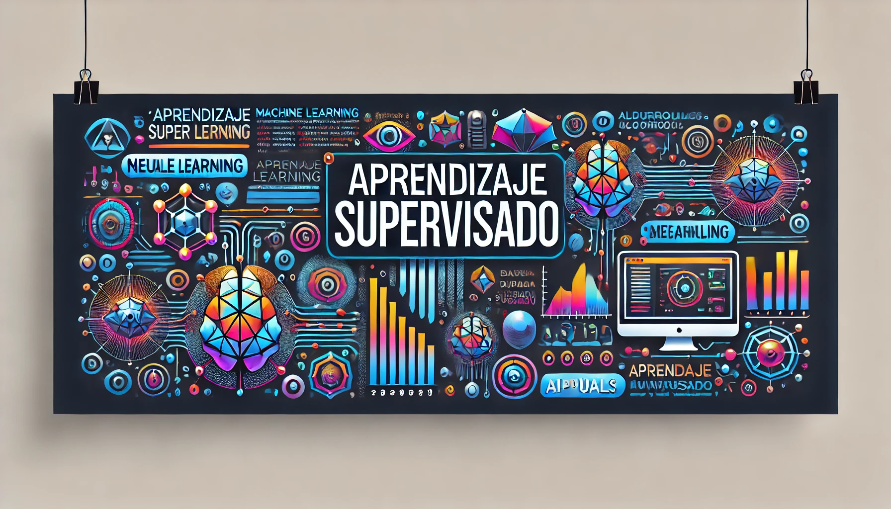

# Apuntes del 7mo Semestre - Ingeniería Estadística e Informática

Este repositorio contiene los apuntes, trabajos, y recursos relacionados con los cursos del 7mo semestre de la carrera de Ingeniería Estadística e Informática. Cada curso está organizado en su propia carpeta, con materiales específicos y recursos de apoyo.

## Cursos del Semestre

### 1. Sistemas Distribuidos


**Descripción**: Este curso aborda los principios y arquitecturas de los sistemas distribuidos, explorando cómo se comunican los nodos dentro de una red y cómo se gestionan los recursos distribuidos. Se cubrirán temas como modelos de comunicación, algoritmos distribuidos, coherencia de datos, y técnicas de tolerancia a fallos.

- **Temas Principales**:
  - Modelos de comunicación en sistemas distribuidos
  - Algoritmos de consenso
  - Gestión de recursos distribuidos
  - Tolerancia a fallos

### 2. Estadística Bayesiana


**Descripción**: Este curso introduce los conceptos y métodos fundamentales de la estadística bayesiana, proporcionando herramientas para la inferencia y modelado estadístico bajo un enfoque bayesiano. Se estudiarán distribuciones previas, verosimilitud, posterior, y el uso de métodos computacionales como MCMC.

- **Temas Principales**:
  - Teorema de Bayes
  - Inferencia Bayesiana
  - Distribuciones previas y posteriores
  - Métodos computacionales (MCMC)

### 3. Ingeniería de Software I


**Descripción**: Este curso ofrece una introducción a los fundamentos de la ingeniería de software, centrándose en el ciclo de vida del desarrollo de software, desde la especificación de requisitos hasta la implementación y pruebas. Se enfatiza en el diseño arquitectónico y la gestión de proyectos de software.

- **Temas Principales**:
  - Ciclo de vida del software
  - Especificación de requisitos
  - Diseño de software y arquitectura
  - Pruebas y aseguramiento de la calidad

### 4. Metodología de la Investigación


**Descripción**: En este curso, se exploran las metodologías de la investigación científica, con un enfoque en la formulación de problemas de investigación, diseño de proyectos, y redacción de informes científicos. El objetivo es desarrollar habilidades para llevar a cabo investigaciones rigurosas en las áreas de estadística e informática.

- **Temas Principales**:
  - Formulación del problema de investigación
  - Diseño metodológico
  - Revisión de la literatura
  - Redacción científica y normas APA

### 5. Aprendizaje Supervisado



**Descripción**: Este curso cubre los conceptos y técnicas fundamentales del aprendizaje supervisado, una rama del machine learning que se basa en el uso de datos etiquetados para entrenar modelos predictivos. Se estudiarán algoritmos como regresión lineal, árboles de decisión, SVM, y redes neuronales.

- **Temas Principales**:
  - Regresión lineal y logística
  - Árboles de decisión y bosques aleatorios
  - Máquinas de soporte vectorial (SVM)
  - Redes neuronales

### 6. Administración de Redes


**Descripción**: Este curso se enfoca en la configuración, administración, y monitoreo de redes de computadoras. Se estudiarán protocolos de red, configuración de routers y switches, así como técnicas de seguridad y resolución de problemas en redes.

- **Temas Principales**:
  - Configuración de routers y switches
  - Protocolos de red y modelos OSI
  - Seguridad en redes
  - Monitoreo y resolución de problemas en redes

## Estructura del Repositorio

- **/Sistemas_Distribuidos/**: Apuntes, trabajos y recursos para el curso de Sistemas Distribuidos.
- **/Estadistica_Bayesiana/**: Apuntes, trabajos y recursos para el curso de Estadística Bayesiana.
- **/Ingenieria_de_Software_I/**: Apuntes, trabajos y recursos para el curso de Ingeniería de Software I.
- **/Metodologia_de_la_Investigacion/**: Apuntes, trabajos y recursos para el curso de Metodología de la Investigación.
- **/Aprendizaje_Supervisado/**: Apuntes, trabajos y recursos para el curso de Aprendizaje Supervisado.
- **/Administracion_de_Redes/**: Apuntes, trabajos y recursos para el curso de Administración de Redes.

## Instrucciones de Uso

1. **Clonar el Repositorio**: 
   ```bash
   git clone https://github.com/daniel-ccopa/apuntes-7mo-semestre.git
   
